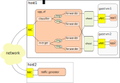

..  BSD LICENSE
    Copyright(c) 2010-2014 Intel Corporation. All rights reserved.
    All rights reserved.

    Redistribution and use in source and binary forms, with or without
    modification, are permitted provided that the following conditions
    are met:

    * Redistributions of source code must retain the above copyright
    notice, this list of conditions and the following disclaimer.
    * Redistributions in binary form must reproduce the above copyright
    notice, this list of conditions and the following disclaimer in
    the documentation and/or other materials provided with the
    distribution.
    * Neither the name of Intel Corporation nor the names of its
    contributors may be used to endorse or promote products derived
    from this software without specific prior written permission.

    THIS SOFTWARE IS PROVIDED BY THE COPYRIGHT HOLDERS AND CONTRIBUTORS
    "AS IS" AND ANY EXPRESS OR IMPLIED WARRANTIES, INCLUDING, BUT NOT
    LIMITED TO, THE IMPLIED WARRANTIES OF MERCHANTABILITY AND FITNESS FOR
    A PARTICULAR PURPOSE ARE DISCLAIMED. IN NO EVENT SHALL THE COPYRIGHT
    OWNER OR CONTRIBUTORS BE LIABLE FOR ANY DIRECT, INDIRECT, INCIDENTAL,
    SPECIAL, EXEMPLARY, OR CONSEQUENTIAL DAMAGES (INCLUDING, BUT NOT
    LIMITED TO, PROCUREMENT OF SUBSTITUTE GOODS OR SERVICES; LOSS OF USE,
    DATA, OR PROFITS; OR BUSINESS INTERRUPTION) HOWEVER CAUSED AND ON ANY
    THEORY OF LIABILITY, WHETHER IN CONTRACT, STRICT LIABILITY, OR TORT
    (INCLUDING NEGLIGENCE OR OTHERWISE) ARISING IN ANY WAY OUT OF THE USE
    OF THIS SOFTWARE, EVEN IF ADVISED OF THE POSSIBILITY OF SUCH DAMAGE.

.. _spp_vf_design:

Design
======

Components
----------

``spp_vf`` supports three types of components, ``forwarder``,
``merger`` and ``classifier``.

Forwarder
~~~~~~~~~

This component provides function for packet processing from one port
to one port.
Incoming packets from port are to be transferred to specific one port.
The direction of this transferring is specified by ``port`` command.
The concept of port is described later of this section.

Merger
~~~~~~

This component provides packet forwarding function from multiple ports
to one port.
Incoming packets from multiple ports are to be transferred to one
specific port.
The flow of this merging process is specified by `port` command.

Classifier
~~~~~~~~~~

This component provides packet forwarding function from one port to
one port.
Classifier has table of virtual MAC address(A). According to this table,
classifier lookups L2 destination MAC address and determines which port
to be transferred to incoming packets.
This component also supports vlan-tag(TPID:0x8100), and has the virtual
MAC tables for each VID(B). If the TPID of incoming packet equals
0x8100,
then lookup these tables(B) and determines which port to be transferred.
Otherwise, incoming packet is transferred according to table(A).

Ports
-----

``spp_vf`` supports three types of PMDs, ``phy`` (Physical NIC),
``ring`` (Ring PMD) and ``vhost`` (vhsot PMD).
Using ``phy`` port, component can get incoming packets from outside host
and transfer the packet to specific physical NIC.
Using ``ring`` port, variety of combination of components can be
configured.
And through ``vhost`` port component can transfer packets from/to VMs.
``port`` can also control vlan tagging and untagging.
