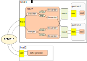

# SPP_VF Config Manual

## Forwarder Type

There are three types of forwarder for 1:1, 1:N and N:1.

  * forward: 1:1
  * classifier_mac: 1:N (Destination is determined by MAC address)
  * merge: N:1

### Restrictions

  * Different types of forwarder cannot assing on same core.
  * Only one classifier_mac is allowed (Cannot use two or more).

## Port Type

There are three port types.

  * phy: Physical NIC
  * vhost: Vhost PMD for VMs
  * ring: Ring PMD for spp components

Each of ports is identified as resource ID with port type and resource ID.
For example, resource ID of physical NIC of ID 0 is described as `phy:0`.

## Config Format

Config files is described in JSON format.
Config file consists of `vfs` and defines the spp_vf attribute.

### Attributes in Config

  * vfs
    * name: Name of the configuration. Please set user as desired.
    * num_vhost: Number of vhosts spp_vf use.
    * num_ring: Number of rings spp_vf use.
    * functions: List of forwarders and its attributes (function means a forwarder).
      * core: Core ID forwarder running on.
      * type: Forwarder type (`forward`, `classifier_mac`, or `merger`).
      * rx_port: Resource ID(s) of rx port.
      * tx_port: Resource ID(s) of tx port.

## Sample Config

Here is default config `spp.json` and network diagram of it.

```json
{
  "vfs": [
    {
      "name": "vf0",
      "num_vhost": 2,
      "num_ring": 4,
      "functions":[
        {
          "core": 2,
          "type": "classifier_mac",
          "rx_port": "phy:0",
          "tx_port": ["ring:0", "ring:1"]
        },
        {
          "core": 3,
          "type": "merge",
          "rx_port": ["ring:2", "ring:3"],
          "tx_port": "phy:0"
        },
        {
          "core": 4,
          "type": "forward",
          "rx_port": "ring:0",
          "tx_port": "vhost:0"
        },
        {
          "core": 5,
          "type": "forward",
          "rx_port": "ring:1",
          "tx_port": "vhost:1"
        },
        {
          "core": 6,
          "type": "forward",
          "rx_port": "vhost:0",
          "tx_port": "ring:2"
        },
        {
          "core": 7,
          "type": "forward",
          "rx_port": "vhost:1",
          "tx_port": "ring:3"
        }
      ]
    }
  ]
}
```

Network diagram

