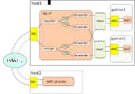

# SPP_VF

SPP_VF is a SR-IOV like network functionality using DPDK for NFV.

## Overview

The application distributes incoming packets depends on MAC address
similar to SR-IOV functionality.
Network configuration is defined in JSON config file which is imported
while launching the application.
The configuration is able to change by sending commnad from spp after
initialization.

SPP_VF is a multi-thread application.
It consists of manager thread and forwarder threads.
There are three types of forwarder for 1:1, 1:N and N:1.

  * forward: 1:1
  * classifier_mac: 1:N (Destination is determined by MAC address)
  * merge: N:1

This is an example of network configration, in which one classifier_mac,
one merger and four forwarders are runnig in spp_vf process for two
destinations of vhost interface.
Incoming packets from rx on host1 are sent to each of vhosts on guest
by looking MAC address in the packet..

## Build the Application

See [setup_guide](setup_guide.md).

## Running the Application

See [how_to_use](how_to_use.md).

## Explanation

The following sections provide some explanation of the code.

### Configuration

### Forwarding

### Packet Cloning
